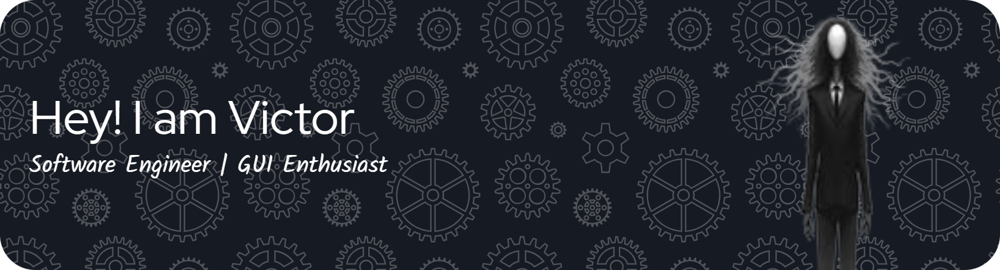

Hi, I am Victor Tabuni. I like to code. I am currently invested in GUI and Simulations. I am learning procedural animation and how I can implement a quest system in everyday life through code. I know it is not consistent with my LinkedIn About Me ://

  

###

#### Techies

#### Socials

