<!-- Panels are generated by scripts/build-hud.mjs — edit text there and re-run `node scripts/build-hud.mjs`. -->

  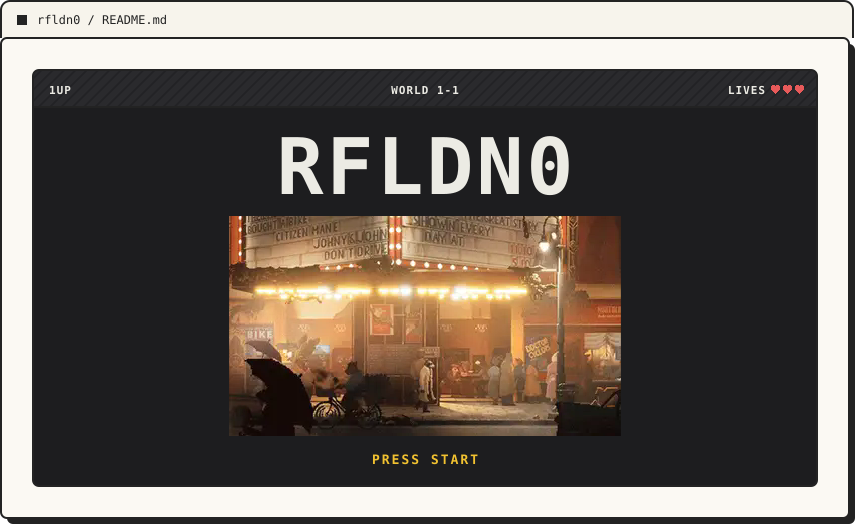

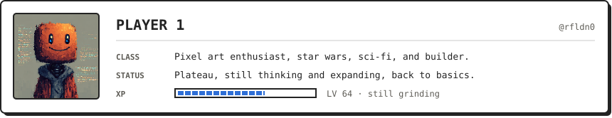

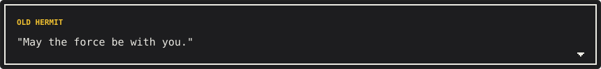

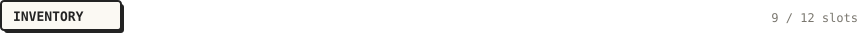
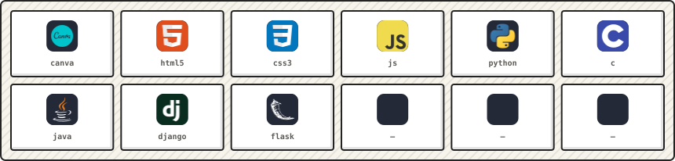

  <a href="https://www.instagram.com/rfldno_/">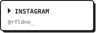</a>
  <a href="https://x.com/rfldno?s=21">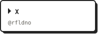</a>
  <a href="https://www.linkedin.com/in/victor-rifaldino-tabuni-14856628b/">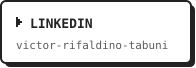</a>
  <a href="https://www.tiktok.com/@rfldno_">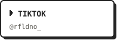</a>

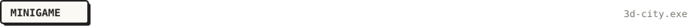

  

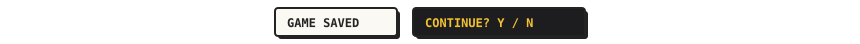
